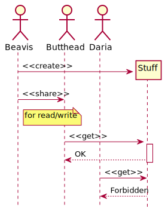
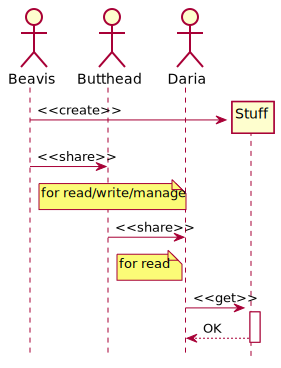
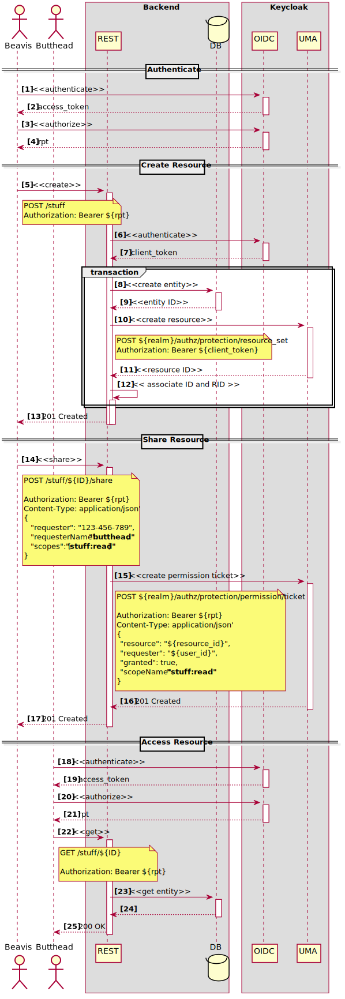
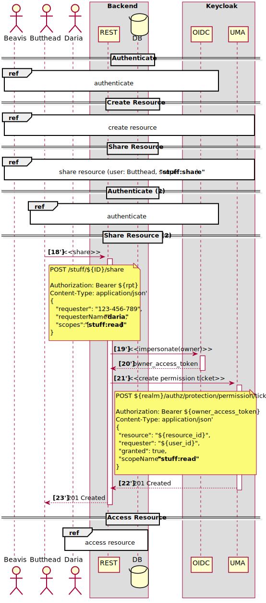

Keycloak UMA Delegation PoC: delegate control over UMA resources to other users
===============================================================================

In Keycloak, [User-Managed Access (UMA)](https://www.keycloak.org/docs/latest/authorization_services/index.html#_service_user_managed_access) allows users to create resources and share them with others. This PoC pushes this concept further, allowing to share not only _access to_, but also _control over_ the resources, especially the aspects thereof covered by [UMA Protection API](https://www.keycloak.org/docs/latest/authorization_services/index.html#_service_protection_api).

**Requirements**: Keycloak 4.8.3.Final

Problem
-------

Let's imagine **Beavis** has some **Stuff** that he wants to share with **Butthead**:

<p align="center">
  
</p>

This use case is perfectly covered by UMA; after resource owner (Beavis) grants access to another user (Butthead), only that user is allowed access, but no others (Daria). Now, let's imagine another use case: **Beavis** wants to share **Stuff** with **Butthead**, also allowing him to share it further with **Daria**:

<p align="center">
  
</p>

There is no out-of-the box solution within the UMA spec; however, we can achieve the same using Keycloak's [impersonation](https://www.keycloak.org/docs/latest/securing_apps/index.html#impersonation) feature. The purpose of this PoC is to demonstrate this approach.

Solution
--------

For the "share" part, the [UMA Photoz](https://github.com/keycloak/keycloak-quickstarts/tree/latest/app-authz-uma-photoz) quickstart was used as a reference. Let's take a closer look at what's under the hood:

<p align="center">
  
</p>

 #|Activity
---|---
1-2|the user authenticates with Keycloak
3-4|the user exchanges access token for a [requesting party token (RPT)](https://www.keycloak.org/docs/latest/authorization_services/index.html#_service_rpt_overview)
5-13|the user requests the backend to create a resource
6-7|the backend authenticates itself with Keycloak using Client Credentials grant
8-9|the backend creates and persists a database entity
10-11|the backend invokes Keycloak's `resource_set` endpoint (part of the UMA Protection API) to create a resource
12|the backend associates persistent DB entity with the resource ID
14-17|the user shares the resource with another user
15| the backend invokes Keycloak's `permission/ticket` endpoint to create a permission
18-21|the grantee authenticates and authorizes with Keycloak
22-25|the grantee accesses the resource

The problem is that the permision can be created only under the owner's identity (this is how it is implemented in Keycloak). Even though the request (15) does come through the backend, the latter uses owner's access token to perform the call to `permission/ticket` (16).

But what if we want the grantee (the other user) to have the same-level access to the resource as the owner - in particular, to be able to manage permissions? Here, we can have the backend temporarily switch identity, in order to invoke the `permission/ticket` endpoint on behalf of the resource owner. In the UNIX world, rough equivalents for this operation would be `su`/`sudo`. In Keycloak's terms, this is called [impersonation](https://www.keycloak.org/docs/latest/securing_apps/index.html#impersonation):

<p align="center">
  
</p>

What now happens inside `/stuff/${ID}/share` endpoint (19'-23') can be described with the following pseudocode:

```
if user has permission with scope "stuff:share" on /stuff/${ID}; then
  if user is the owner of /stuff/${ID}; then
    token := original token
  else
    token := impersonate(owner)
  end if
else
  deny access
end if

create permission ticket using token;
```

In Keycloak, impersonation comes in different flavors; the one that is used in the PoC is called [Direct Naked Impersonation](https://www.keycloak.org/docs/latest/securing_apps/index.html#direct-naked-impersonation). It allows applications (clients) to obtain access tokens for arbitrary users. This is a powerful feature that should be used with caution, and needs to be enabled explicitly (see below).

Setup
-----

`uma-poc-realm.json` contains exported realm data which can be imported and used right away. But if you want to reproduce the configuration on your own, here are the steps:

1. Run Keycloak with `-Dkeycloak.profile=preview` and `-Djboss.socket.binding.port-offset=100`;
1. Create `uma-poc` realm;
1. Create users `beavis`, `butthead` and `daria` with the passwords same as usernames;
1. Create `uma-poc-backend` client:
    1. Add `http://localhost:8080/uma-poc/*` as a redirect URI;
    1. Enable Authorization;
    1. Go to Authorization → Authorization Scopes, create scopes `stuff:read`, `stuff:write`, `stuff:delete` and `stuff:share`;
    1. Go to Authorization → Resources, create "Stuff Resource":  
      Name: Stuff Resource  
      Display name: Stuff Resource  
      Type: `urn:carretti.pro:stuff`  
      URI: `/stuff/*`  
      Scopes: `stuff:read` `stuff:write` `stuff:share` `stuff:delete`  
    1. Go to Policies, create a policy of type JS:  
      Name: Only Owner Policy  
      Script:  
       ```javascript
       var permission = $evaluation.getPermission();
       var identity = $evaluation.getContext().getIdentity();
       var resource = permission.getResource();

       if (resource) {
           if (resource.getOwner().equals(identity.getId())) {
               $evaluation.grant();
           }
       }
       ```
    1. Go to Permissions, create resource permission:  
      Name: Only Owner Permission  
      Resource:  Stuff Resource  
      Scopes: `stuff:read` `stuff:write` `stuff:share` `stuff:delete`  
      Apply Policy: (select Only Owner Policy)
1. Go to Users → Permissions, turn on "Permissions Enabled";
1. Click "impersonate", create a policy of type "Client":  
Name: `impersonate-uma-poc-backend-policy`  
Client: `uma-poc-backend`

Build, Deploy and Run
---------------------

1. Build:

   ````
   mvn -DskipTests=true clean install
   ````

2. Run Keycloak:
   ````
   $KEYCLOAK_HOME/bin/standalone.sh \
       -Dkeycloak.profile=preview \
       -Djboss.socket.binding.port-offset=100
   ````
   Or, with full realm import:
   ````
   $KEYCLOAK_HOME/bin/standalone.sh \
       -Dkeycloak.profile=preview \
       -Djboss.socket.binding.port-offset=100 \
       -Dkeycloak.migration.action=import \
       -Dkeycloak.migration.provider=singleFile \
       -Dkeycloak.migration.file=/path/to/uma-poc-realm.json \
       -Dkeycloak.migration.strategy=IGNORE_EXISTING
   ````

3. Run the PoC:

   ````
   mvn -DskipTests=true thorntail:run
   ````

4. Run tests:

   ````
   mvn test
   ````
   
